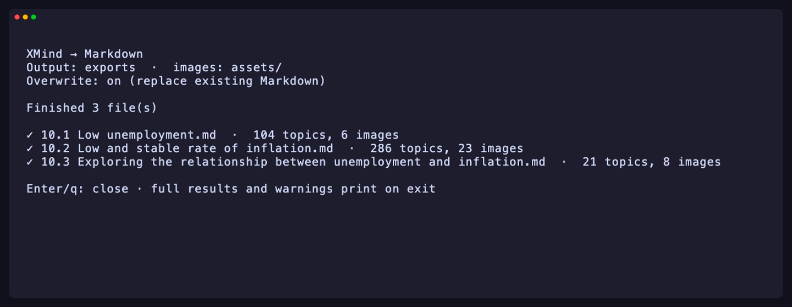

# mark-Xmind-down

[](https://github.com/michaelmjhhhh/mark-Xmind-down/actions/workflows/ci.yml)
[](go.mod)
[](https://github.com/michaelmjhhhh/mark-Xmind-down/actions/workflows/ci.yml)

Convert XMind files to Markdown, with images saved in a linked `assets/` folder. Works on macOS, Windows, and Linux. Includes a [Bubble Tea](https://github.com/charmbracelet/bubbletea) terminal browser.



## Install

With [Go 1.26.7+](https://go.dev/dl/) installed:

```sh
go install github.com/michaelmjhhhh/mark-Xmind-down/cmd/xmind-md@latest
```

If `xmind-md` is not found, add your Go binary directory to `PATH`—normally `~/go/bin`, or `%USERPROFILE%\go\bin` on Windows. See [build from source](docs/reference.md#build-and-run) for an alternative.

## Convert

One file → `My Map.md` beside the original:

```sh
xmind-md "My Map.xmind"
```

All XMind files in a folder → `exports/`:

```sh
xmind-md maps -d exports
```

Add `-r` to include subfolders; add `-f` to replace existing Markdown:

```sh
xmind-md maps -r -d exports -f
```

Choose a filename with `-o notes/map.md`. Use `xmind-md --help` for all options. The original XMind files are never changed.

## Browse interactively

Run without arguments in a terminal:

```sh
xmind-md
```

- **↑/↓**: move; **Enter**: open a folder or select a file.
- **Space**: select multiple files; **a**: select all files here.
- **e**: export selected files, or the highlighted file if none are selected.
- **f**: toggle overwriting existing Markdown; **q**: quit.

To save interactive exports in one folder, run `xmind-md --tui -d exports`.

## Output

```text
exports/
  My Map.md
  assets/
    <image-hash>.png
```

Images are linked automatically and identical images are reused. **Move or share the Markdown and its `assets/` folder together.**

Supports modern and legacy XMind files, multiple sheets, topic hierarchies, notes, links, and embedded images. Canvas styling is flattened; known unsupported content produces warnings. Encrypted files are unsupported. Read the [format and command reference](docs/reference.md) for details.

## Development

From a checkout, run `go test ./...`. CI tests macOS, Windows, and Linux.

All **411 topics and 37 images** in the supplied samples have been checked for content, hierarchy, links, and exact image bytes. See the [QA report](docs/qa-report.md) and [format research](docs/research.md).
