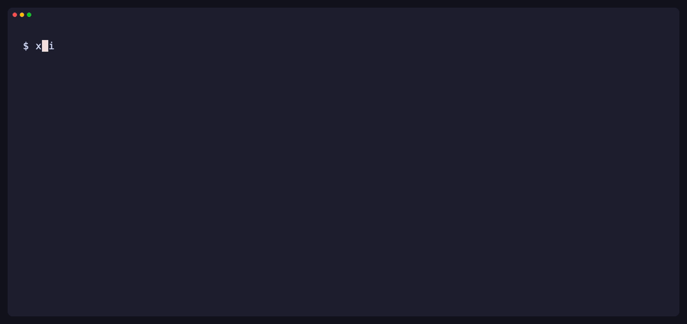

# mark-Xmind-down

[](https://github.com/michaelmjhhhh/mark-Xmind-down/actions/workflows/ci.yml)
[](go.mod)
[](https://github.com/michaelmjhhhh/mark-Xmind-down/actions/workflows/ci.yml)

Turn XMind maps into Markdown with linked local images. Browse, select, and export using only your keyboard in a [Bubble Tea](https://github.com/charmbracelet/bubbletea) terminal interface.



## Install

No Go installation or administrator access needed. PATH is configured automatically for this terminal and future sessions.

**macOS / Linux** (Bash or Zsh):

```sh
eval "$(curl -fsSL https://raw.githubusercontent.com/michaelmjhhhh/mark-Xmind-down/main/scripts/install.sh || printf 'false')"
```

**Windows** (PowerShell):

```powershell
irm https://raw.githubusercontent.com/michaelmjhhhh/mark-Xmind-down/main/scripts/install.ps1 | iex
```

Re-run the installer to update. [Other shells and source builds →](docs/reference.md#installation)

## Open the file browser

```sh
xmind-md
```

The browser opens in your current folder. Contextual hints highlight the available actions; press **?** for grouped keyboard help.

| Key | Action |
| --- | --- |
| **↑ / ↓** | Move through files and folders |
| **Enter** | Open a folder or select a file |
| **Space** / **a** | Select a file / select all files here |
| **o** | Choose an output folder; **Space** confirms it |
| **e** | Export selected files, or the highlighted file |
| **?** | Show all keys; **Esc** closes help |
| **q** | Quit |

By default, Markdown is saved beside each original. Press **Esc** to cancel the output-folder picker. To start browsing a different folder, use `xmind-md --tui maps`.

## Output

```text
My Map.md
assets/
  <image-hash>.png
```

Images are linked automatically; identical images are reused. **Keep the Markdown and its `assets/` folder together.** Original XMind files are never changed.

Supports modern and legacy XMind files, multiple sheets, topic hierarchies, notes, links, and images. Canvas styling is flattened; known unsupported content produces warnings. Encrypted files are unsupported.

## Automate exports

```sh
xmind-md "My Map.xmind"            # One file
xmind-md maps -d exports          # A folder
xmind-md maps -r -d exports -f    # Include subfolders and replace output
```

Use `xmind-md --help` for options, or read the [full reference](docs/reference.md).

## Development

Run `go test ./...`. CI checks macOS, Windows, and Linux. All **411 topics and 37 images** in the supplied samples are covered by fidelity checks.

Re-record the demo with [VHS](https://github.com/charmbracelet/vhs) (requires `ttyd`, `ffmpeg`, and a Chromium-based browser):

```sh
go build -o bin/xmind-md ./cmd/xmind-md
env -u NO_COLOR COLORTERM=truecolor vhs docs/demo-gif.tape
```

[Changelog](CHANGELOG.md) · [QA report](docs/qa-report.md) · [Format research](docs/research.md) · [Contributing changes](docs/reference.md#development-and-verification)

## License

This project is licensed under the [MIT License](LICENSE).
